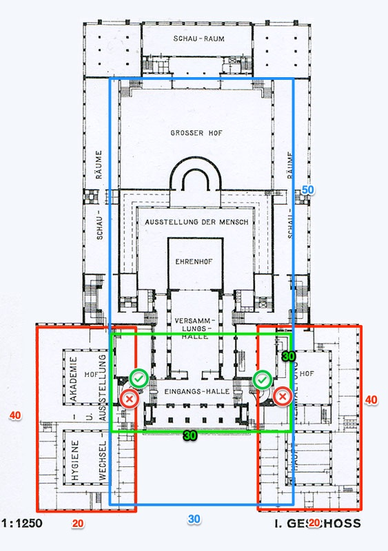

# Workadventure for DLC

This is a starter kit to help you build your own map for [WorkAdventure](https://workadventu.re).

To understand how to use this starter kit, follow the tutorial at [https://workadventu.re/map-building](https://workadventu.re/map-building).


## Installation

With npm installed (comes with [node](https://nodejs.org/en/)), run the following commands into a terminal in the root directory of this project:

```shell
npm install
npm run start
```

The project will run at <http://localhost:8080/>

## Licenses

This project contains multiple licenses:

* [Code license](./LICENSE.code) *(all files except those for other licenses)*
* [Map license](./LICENSE.map) *(`map.json` and the map visual as well)*
* [Assets license](./LICENSE.assets) *(the files inside the `src/assets/` folder)*

### About third party assets

If you add third party assets in your map, do not forget to:

1. Credit the author and license with the "tilesetCopyright" property present in the properties of each tilesets in the `map.json` file
2. Add the license text in LICENSE.assets

## Tasks

### Maps




Nebenräume sind: Nachbesprechungsräume ODER Allgemeine Quatschräume (Räume beschriften!)

EG Mitte innen + außen davor (tbre + mcbl):
-> center-level-zero.json
30x50 Tiles

* halle grünfläche, bänke, eisstand, liegewiesen
* empfangsschalter links/rechts, säulengang links/rechts, nebenräume nur andeuten
* ehrenhof = bar
* großer hof = grünzeug + bühne (musikstream)

Linker Flügel (mrre):
-> left-wing.json
20x40 Tiles

* hinten kleiner Innenhof
* vorne großer Glaskasten
* 2 Nebenräume

Rechter Flügel (avst):
-> right-wing.json
20x40 Tiles

* 2 Innenhöfe
* 3 Nebenräume

Mitte Etage 1/Mitte Etage 2 (seso):
-> center-level-one.json
-> center-level-two.json
30x30 Tiles

* Etage 1
  * Bar
  * 2-3 Meetingräume
* Etage 2
  * Bar
  * Großer Versammlungssaal (hauptstream vom dlc?)
    * Evtl Website mit Stream öffnen?
    * Oder kann man sogar direkt streamen?

### Weitere Aufgaben

* Schematische Übersichtskarte für Event: Wo ist was?

Optional:

* Scripten von Tasks / NPCs mit Achievement
* Custom Avatare
* Toilette!

### Namenskonventionen

* Eingangshalle+Außenbereich
